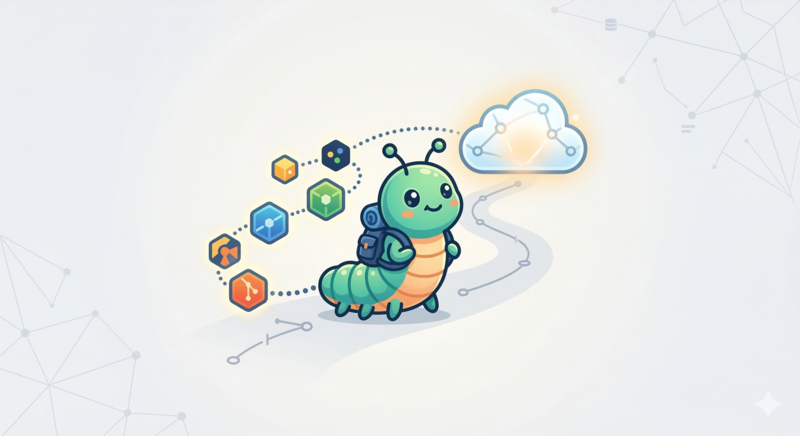

<p align="center">
  
</p>

<h1 align="center">gritgrub</h1>

<p align="center">
  A self-hosted code collaboration platform — what GitHub would be if designed today with AI agents as first-class users.
</p>

<p align="center">
  <a href="#architecture">Architecture</a> |
  <a href="#getting-started">Getting Started</a> |
  <a href="#status">Status</a> |
  <a href="#design-philosophy">Design Philosophy</a>
</p>

---

## Why

Git hosting platforms were designed for humans clicking buttons. Agents need machine-readable capabilities, cryptographic attestation of every action, and fine-grained scoped tokens — not OAuth browser flows. gritgrub treats agents and humans as equals.

## Architecture

```
crates/
  core/     Object model, identity, signing, tokens, policies, exploration, pipelines, events, capability tokens
  store/    redb storage, capability system, ref policies, GC, tree diff, B-tree range queries
  api/      gRPC server, HTTP/JSON gateway, web dashboard, agent SDK, SSE events, provisioning
  cli/      `forge` binary — 30+ commands for VCS, exploration, pipelines, provisioning, watching
```

**Key design decisions:**

- **BLAKE3** for content addressing (1 GB/s, parallel) and capability token HMAC chains
- **postcard** for storage (deterministic → reproducible hashes), **protobuf** for gRPC wire format
- **redb** for embedded storage — ACID, single-file, B-tree range queries
- **Ed25519** signing with DSSE envelopes for supply-chain attestations
- **Capability tokens v3** — macaroon-style HMAC chain auth, zero database lookups, delegatable by attenuation
- **Exploration tree** — goals/approaches/claims protocol for multi-agent parallel search
- **Embedded CI** — verification pipelines stored as signed attestations in the DAG

## Getting Started

```bash
cargo build --release

# Initialize + commit
forge init
forge commit -m "initial commit"

# Start server with web dashboard
forge serve --http-addr 0.0.0.0:8080 --no-tls
# Open http://localhost:8080 in browser

# Multi-agent exploration
forge explore create "implement rate limiting" --constraint "tests:all tests pass"
forge provision batch --count 5 --goal <id> --server https://server:50051
forge watch                     # live event stream
forge explore promote <id> --approach <winner>

# Verification pipeline (embedded CI)
forge pipeline run              # test + lint + build, creates signed attestation
forge pipeline show             # structured results

# Collaborate
forge push / forge pull / forge clone
```

## Design Philosophy

### Exploration Tree — Not Branches

Git has branches. gritgrub has **goals** — structured search spaces where agents explore approaches in parallel:

```
Goal: "implement rate limiting"
  approach-0: token-bucket (agent-0, 4 commits, tested)
  approach-1: leaky-bucket (agent-1, 2 commits, tested)
  approach-2: sliding-window (agent-2, 1 commit, builds)
  → promote winner → merge into main
```

Each approach is a branch with semantic context. Claims prevent duplicate work. TTL-based heartbeats prevent deadlocks from crashed agents.

### CI as Attestation, Not Service

No Jenkins. No GitHub Actions. No YAML. The agent runs verification locally, signs the result with its Ed25519 key, and the VCS trusts the signed proof:

```
forge pipeline run → test (129 passed) + lint (clean) + build (ok)
                   → signed attestation stored in the DAG
                   → ref policy checks attestation, not CI status
```

### Capability Tokens — Zero-Lookup Auth

Traditional auth: parse token → database lookup (public key) → verify signature → database lookup (revocation) = ~120us, 2 DB reads.

Capability tokens v3: parse → HMAC-BLAKE3 chain verify (in-memory) → check embedded caveats = ~5us, 0 DB reads.

Tokens are delegatable by attenuation — an agent can narrow its own permissions and hand the result to a sub-agent without contacting the server. Caveats can only be added, never removed.

### Concurrent Agents at Scale

- **Immutable objects**: content-addressed, zero coordination
- **CAS ref updates**: lock-free, retry on contention
- **B-tree range queries**: O(log n + k) ref/object lookups, not O(n) scans
- **Push-based SSE**: instant dashboard updates via Notify channel
- **12-thread stress tests**: concurrent stash, objects, approaches, events

### Security

- Trail of Bits-style sharp-edges audit
- CAS-based concurrency (no lost updates)
- Ref policy enforcement on all code paths (including CasRef)
- 36 property tests + 3 fuzz targets
- 12 RBAC integration tests (scope isolation, expiry, concurrent grants)
- Input validation on all HTTP endpoints
- Configurable CORS

## Status

**198 tests. forge self-verifies on every commit.**

| Component | Status |
|-----------|--------|
| Content-addressed storage (BLAKE3 + redb) | Shipped |
| Identity + capability system | Shipped |
| Token system (v1/v2/v3 capability tokens) | Shipped |
| Ed25519 signing + DSSE attestations | Shipped |
| SLSA/SBOM/review attestations | Shipped |
| Ref policies + CAS enforcement | Shipped |
| gRPC server + HTTP/JSON gateway | Shipped |
| Web dashboard + SSE live events | Shipped |
| Exploration tree (goals/approaches/claims) | Shipped |
| Verification pipelines (embedded CI) | Shipped |
| Agent provisioning (CLI + HTTP API) | Shipped |
| Agent SDK (Rust HTTP client library) | Shipped |
| Garbage collection (mark-and-sweep) | Shipped |
| Tree-to-tree diff + diff API | Shipped |
| Push / Pull / Clone (gRPC sync) | Shipped |
| Git import/export | Shipped |
| B-tree range queries | Shipped |
| Property tests + fuzz targets | Shipped |
| Concurrency stress tests (12 threads) | Shipped |
| Sharp-edges security hardening | Shipped |

## License

MIT
